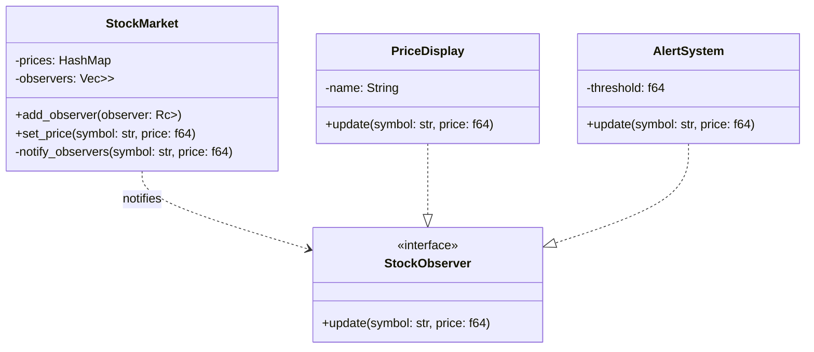

# Stock Market Monitor (Observer Pattern)

This project demonstrates the implementation of the Observer pattern in Rust using a Stock Market monitoring system as a real-world example.

## Overview

The Stock Market Monitor allows multiple observers (displays and alert systems) to receive updates whenever stock prices change. This showcases how the Observer pattern can be used to implement a publish-subscribe model.

## Features

- Real-time updates of stock prices to multiple observers
- Different types of observers (displays and alert systems)
- Easy addition of new observers

## Mermaid Diagram

The following diagram illustrates the structure and flow of the Stock Market Monitor using the Observer pattern:



## How it works

1. The `StockMarket` (subject) maintains a list of observers and current stock prices.
2. Observers (`PriceDisplay` and `AlertSystem`) implement the `StockObserver` trait.
3. When a stock price is updated via `set_price()`, all registered observers are notified.
4. Each observer type handles the update differently:
    - `PriceDisplay` simply displays the new price.
    - `AlertSystem` checks if the price exceeds a threshold and issues an alert if it does.

## Usage

To use the Stock Market Monitor in your code:

```rust
let mut stock_market = StockMarket::new();

let display = Rc::new(RefCell::new(PriceDisplay {
    name: String::from("Main Display"),
}));
let alert = Rc::new(RefCell::new(AlertSystem {
    threshold: 100.0,
}));

stock_market.add_observer(display);
stock_market.add_observer(alert);

// Update a stock price
stock_market.set_price("AAPL", 150.0);
```

## Running the Example

1. Ensure you have Rust installed.
2. Clone this repository.
3. Run `cargo run` to see the Stock Market Monitor in action.

## Notes

The Observer pattern is excellent for implementing distributed event handling systems. It's widely used in implementing distributed event handling systems, MVC architectural pattern, and in designing user interface toolkits. However, if overused, it can lead to complex systems where observers are difficult to track and maintain.