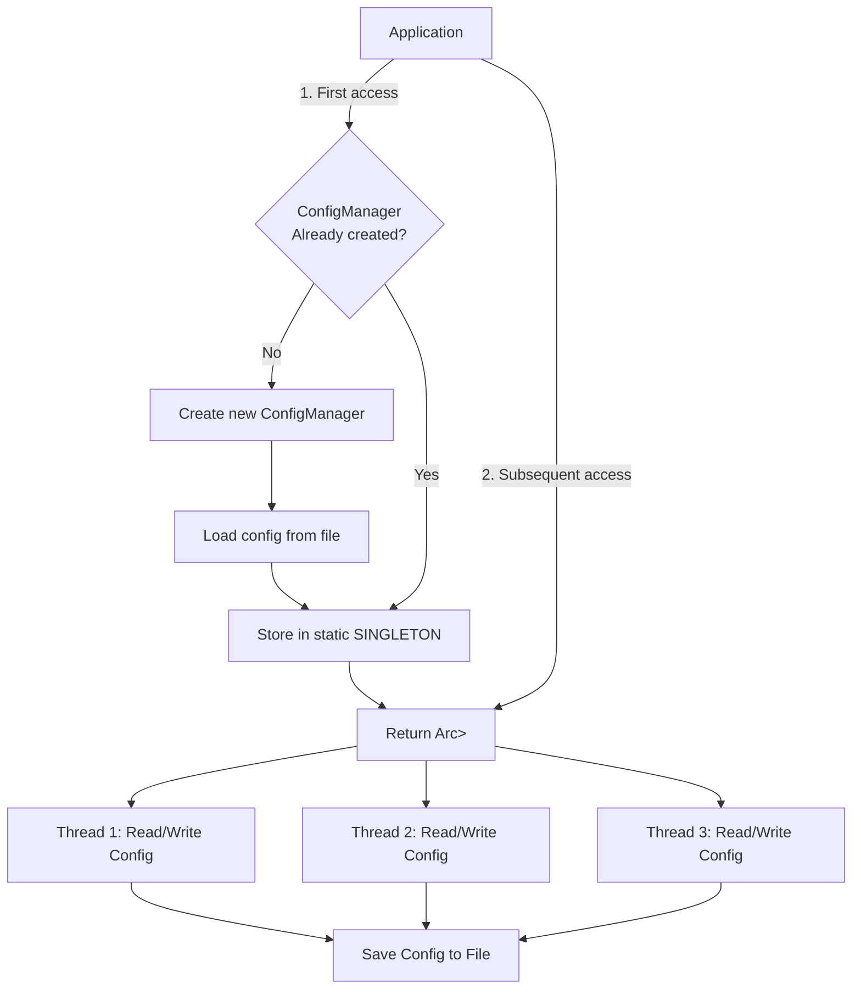

# ConfigManager Singleton

This project demonstrates the implementation of the Singleton pattern in Rust using a `ConfigManager` as a real-world example.

## Overview

The `ConfigManager` is a thread-safe, globally accessible configuration manager that ensures only one instance of the configuration is created and shared across the entire application.

## Features

- Thread-safe access to configuration
- Lazy initialization
- Ability to read and write configuration values
- Persistence of configuration to a file

## Mermaid Diagram

The following diagram illustrates the structure and flow of the ConfigManager Singleton:



## How it works

1. The application requests access to the ConfigManager via the `get_config()` function.
2. If it's the first access, a new ConfigManager is created, the configuration is loaded from a file, and the instance is stored in a static variable.
3. For all accesses (first and subsequent), an `Arc<Mutex<ConfigManager>>` is returned, allowing thread-safe access to the shared configuration.
4. Multiple threads can read from and write to the configuration concurrently.
5. Changes to the configuration can be saved back to the file.

## Usage

To use the ConfigManager in your code:

```rust
let config = get_config();
let config_guard = config.lock().unwrap();

// Read a value
let db_url = config_guard.get("database_url").cloned().unwrap_or_default();

// Write a value
config_guard.set("new_key".to_string(), "new_value".to_string());

// Save changes
config_guard.save().unwrap();
```

## Running the Example

1. Ensure you have Rust installed.
2. Clone this repository.
3. Create a `config.toml` file in the project root with some initial configuration.
4. Run `cargo run` to see the ConfigManager in action.

## Notes

While the Singleton pattern can be useful for managing global state, it should be used judiciously. Consider whether dependency injection or simple module-level variables might be more appropriate for your use case.